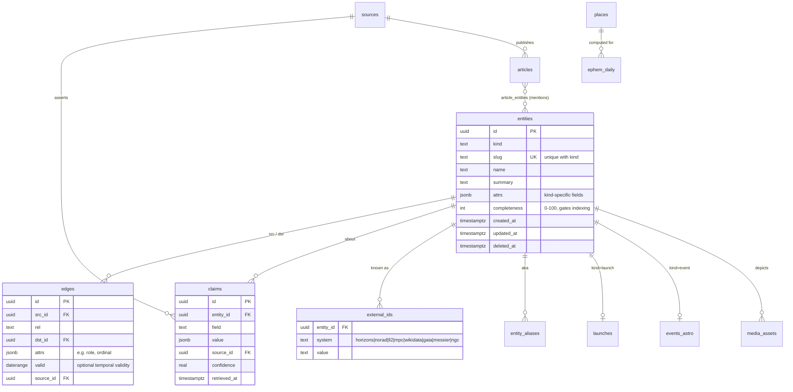

# Orrery — Core Data Model (Phase 2 deliverable)

> The knowledge graph as boring, indexed Postgres. Same logical model v1 §3.3 describes for a graph store —
> physically three core tables (`entities`, `edges`, `claims`) plus typed satellites where query patterns demand columns.
> Drizzle migrations will be generated from this document in Phase 3; this document remains the source of truth.

## 1. Design principles
1. **Everything notable is an entity; every relationship is an edge.** Features read the graph; nothing renders from hand-maintained lists (PRD ENT-5).
2. **Provenance is structural.** Displayed facts trace to `claims` rows carrying source + retrieved-at + confidence (PRD ENT-4). MVP populates claims coarsely (one per connector batch) but the shape exists from migration 0001.
3. **Typed satellites, not entity-table bloat.** High-volume/high-query kinds (launches, events, articles) get 1:1 or standalone tables keyed to `entities` where they are graph-visible.
4. **UTC everywhere; `timestamptz` only.** Timezone conversion is presentation-layer (PRD LOC-4).
5. **Soft delete + audit** on editorially-touched tables (`deleted_at`, `revisions` JSONB trail).
6. **IDs:** `uuid v7` primary keys (time-ordered); public URLs use `slug`, never UUIDs (IA §2).

## 2. ERD (core)



## 3. Registries (closed enums, extended by migration only)

**`entity_kind`:** `object` · `mission` · `spacecraft` · `launch` · `vehicle` · `engine` · `pad` · `site` · `agency` · `company` · `person` · `instrument` · `telescope` · `observatory` · `event` · `gear_product`(T1) · `club`(T3) · `place`
**`edge_rel` (MVP set):** `orbits` · `moon_of` · `part_of` · `carries` (spacecraft→instrument) · `observed` · `discovered_by` · `operated_by` · `built_by` · `launched_on` (mission→launch) · `launched_from` (launch→pad) · `used_vehicle` (launch→vehicle) · `member_of` (person→agency) · `flew_on` (person→launch/mission) · `successor_of` · `targets` (mission→object) · `involves` (event→entity) · `mentions` (article→entity; materialized in `article_entities`)
**`event_kind`:** `moon_phase` · `solar_eclipse` · `lunar_eclipse` · `meteor_shower` (window) · `meteor_peak` · `conjunction` · `opposition` · `elongation` · `perigee_syzygy` · `equinox_solstice` · `launch_window` (mirror of launches for calendar UNION) · `milestone` (curated)
**`external_id.system`:** `horizons` (499=Mars), `norad`, `ll2` (Launch Library UUID), `mpc`, `wikidata` (QID — free interop win), `gaia_dr3`, `messier`, `ngc`, `iau_csn`.

## 4. DDL sketches (representative; full DDL generated in Phase 3)

```sql
create table entities (
  id           uuid primary key default uuidv7(),
  kind         entity_kind not null,
  slug         text not null,
  name         text not null,
  summary      text,
  attrs        jsonb not null default '{}',   -- validated per-kind by zod at write time
  completeness int  not null default 0,
  created_at   timestamptz not null default now(),
  updated_at   timestamptz not null default now(),
  deleted_at   timestamptz,
  unique (kind, slug)
);
create index on entities using gin (to_tsvector('english', name || ' ' || coalesce(summary,'')));

create table edges (
  id        uuid primary key default uuidv7(),
  src_id    uuid not null references entities(id),
  rel       edge_rel not null,
  dst_id    uuid not null references entities(id),
  attrs     jsonb not null default '{}',
  valid     daterange,
  source_id uuid references sources(id),
  unique (src_id, rel, dst_id)
);
create index on edges (src_id, rel);
create index on edges (dst_id, rel);          -- reverse traversal is first-class

-- Typed satellite: launches (1:1 with entities where kind='launch')
create table launches (
  entity_id     uuid primary key references entities(id),
  ll2_id        text unique,
  status        text not null,                -- go|tbc|tbd|hold|success|failure|partial
  net           timestamptz,                  -- current NET (mutable)
  window_start  timestamptz,
  window_end    timestamptz,
  slug_minted   boolean not null default false,
  webcast_url   text,
  net_history   jsonb not null default '[]',  -- [{net, changed_at}] → PRD LNCH-4 trust feature
  raw           jsonb not null default '{}',  -- last LL2 payload for reprocessing
  synced_at     timestamptz not null
);

-- Typed satellite: computed/curated astronomical events
create table events_astro (
  entity_id    uuid primary key references entities(id),
  event_kind   event_kind not null,
  peak_at      timestamptz not null,
  starts_at    timestamptz,
  ends_at      timestamptz,
  magnitude    real,                          -- filterable brightness where meaningful
  visibility   jsonb not null default '{}',   -- kind-specific: eclipse path bbox+geojson ref, shower ZHR & radiant, pair separation…
  computed_by  text not null,                 -- 'astronomy-engine@x.y' | 'editorial'
  computed_at  timestamptz not null
);
create index on events_astro (peak_at);
create index on events_astro (event_kind, peak_at);

create table articles (
  id            uuid primary key default uuidv7(),
  source_id     uuid not null references sources(id),
  url           text not null unique,          -- canonicalized
  title         text not null,
  excerpt       text,
  image_url     text,                          -- hotlink-policy-checked
  lang          text not null default 'en',
  published_at  timestamptz not null,
  ingested_at   timestamptz not null default now(),
  dedupe_key    text                           -- canonical-link/title-hash grouping (NEWS-2)
);
create table article_entities (               -- materialized 'mentions' edges (news volume)
  article_id uuid references articles(id),
  entity_id  uuid references entities(id),
  salience   real not null default 0.5,
  matched_by text not null,                    -- 'alias-dict@v0' | 'reviewer'
  primary key (article_id, entity_id)
);

create table sources (
  id          uuid primary key default uuidv7(),
  key         text unique not null,            -- 'll2', 'nasa-newsroom', 'horizons', …
  name        text not null,
  homepage    text,
  tier        int not null default 3,          -- 1=primary/agency … 4=aggregated
  license     text,                            -- license/terms note (Master Plan §9)
  poll_secs   int,
  last_success_at timestamptz,                 -- feeds /status freshness page (OBS-2)
  enabled     boolean not null default true
);

create table places (                          -- offline gazetteer (LOC-2) + city pages
  id        text primary key,                  -- geonames id
  slug      text unique not null,              -- 'lahore', 'paris-fr'
  name      text not null,
  country   text not null,
  lat       double precision not null,
  lon       double precision not null,
  tz        text not null,                     -- IANA
  pop       int,
  page_tier int not null default 0             -- 0=picker-only, 1..3=has /sky/tonight page
);

create table ephem_daily (                     -- nightly batch cache (v1 §3.4 'precomputed' tier)
  place_id  text references places(id),
  date      date not null,
  body      text not null,                     -- 'sun','moon','mars',…
  data      jsonb not null,                    -- rise/set/transit, alt-az samples, mag, phase
  primary key (place_id, date, body)
);

create table media_assets (
  id         uuid primary key default uuidv7(),
  entity_id  uuid references entities(id),
  kind       text not null,                    -- image|video-link|diagram
  url        text not null,                    -- R2 key for owned, absolute for embedded
  credit     text not null,                    -- attribution string (structural, §9.2 #3)
  license    text not null,                    -- 'public-domain-nasa' | 'cc-by-4.0-esa' | …
  meta       jsonb not null default '{}'
);

create table redirects (from_path text primary key, to_path text not null, created_at timestamptz default now());
```

**Phase-6 additions (designed, not created yet):** `users`, `sessions`, `follows(user_id, entity_id)`, `alert_rules`, `push_subscriptions`, `ics_tokens`, `email_log`. **Track additions:** `gear_products` + `gear_compat_rules` (T1), `observations`/`uploads` (T3), `api_keys`/`usage` (T4).

## 5. Worked examples (how real things land in the graph)

- **Saturn:** `entities(kind=object, slug=saturn, attrs:{class:'planet', radius_km:58232, moon_count_known:'270+'})` · edges: `titan —moon_of→ saturn`, `cassini —targets→ saturn` · external_ids: `horizons:699`, `wikidata:Q193`. Page = entity + edge traversal + `ephem` live module + `article_entities` tab + next `events_astro` involving Saturn.
- **A Falcon 9 launch:** `entities(kind=launch)` + `launches` row (ll2_id, net, net_history) · edges: `—used_vehicle→ falcon-9`, `—launched_from→ slc-40`, `starlink-g12-x —launched_on→ (this)`, `spacex —operated_by⁻¹…` · calendar UNION exposes it as `launch_window`.
- **2026-08-12 eclipse:** `entities(kind=event, slug=2026-08-12-total-solar-eclipse)` + `events_astro(event_kind=solar_eclipse, visibility:{path_geojson_ref, max_duration_s})` · edges `—involves→ sun, moon` · per-city circumstances computed on demand + cached in `ephem_daily`-style rows.
- **A JWST news item:** `articles` row + `article_entities → jwst(mission)` — the "all JWST news" tab is `select … join article_entities where entity_id = jwst`.

## 6. Query patterns the schema must serve cheaply (verified in Phase 3 with EXPLAIN)
1. Entity page bundle: entity + edges (both directions, grouped by rel) + top media + latest 10 tagged articles + next 5 related events — target ≤ 6 indexed queries, ≤ 30 ms warm.
2. Calendar range: `events_astro` + `launches` UNION over `[from,to)` with kind filters — single index-range scan each.
3. "Visible tonight from (lat,lon)": `ephem_daily` lookup for nearest place-grid point + client refinement (TNGT-1).
4. Freshness dashboard: `sources.last_success_at` scan (OBS-2).
5. Search v0: Postgres FTS over entities + articles with kind boosting (T9).

## 7. Entity resolution (v0 policy)
Connectors must resolve to existing entities via `external_ids` before creating; unresolved incoming records go to a `staging_entities` review queue rather than silently minting duplicates (the v1 "most important ML investment" starts as this deterministic rule + human queue). Aliases (`entity_aliases(entity_id, alias, lang)`) power both news tagging (NEWS-3) and search synonyms; every alias merge is a claims-logged edit.
